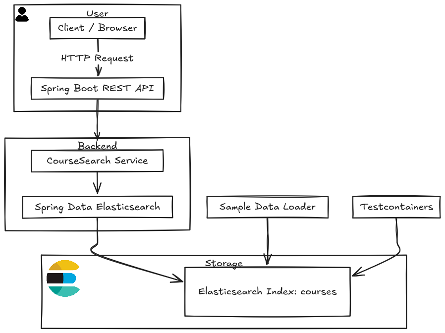

# CourseSearch

## Overview

This is a Spring Boot + Spring Data Elasticsearch service that indexes and searches courses. It exposes a single REST endpoint for searching with full-text, filters, sorting, and pagination. It can run with a local Elasticsearch via Docker/Podman or with Testcontainers during tests (auto-disabled when containers are unavailable).

## Prerequisites

- Java 17+
- Maven 3.9+
- Elasticsearch 8.x (local via Docker/Podman or remote)

## Quick start (Podman)

1. **Start Elasticsearch 8.11.1:**

```bash
podman run --name es-local -p 9200:9200 -p 9300:9300 \
    -e discovery.type=single-node \
    -e xpack.security.enabled=false \
    -e xpack.security.enrollment.enabled=false \
    -e ES_JAVA_OPTS="-Xms512m -Xmx512m" \
    docker.elastic.co/elasticsearch/elasticsearch:8.11.1
```

2. **Run the app:**

```bash
./mvnw spring-boot:run
```

3. **Health check:**

```bash
curl -s http://localhost:8080/api/health
```

## OpenAPI / Swagger UI

- **Swagger UI:** http://localhost:8080/swagger-ui.html
- **OpenAPI JSON:** http://localhost:8080/v3/api-docs

## Sample data

On startup, if the index is empty, the app loads sample documents from `src/main/resources/sample_courses.json`. If you change the sample file, delete the index to re-import:

```bash
curl -X DELETE http://localhost:9200/courses
```

## Configuration

Edit `src/main/resources/application.yml` if you are not using localhost:9200.

## API

### GET /api/health

Returns a simple health string.

### GET /api/search

**Parameters:**

- `q`: Optional text query (title/description)
- `category`: Exact match
- `type`: ONE_TIME | COURSE | CLUB
- `minAge`, `maxAge`: Age overlap (minAge <= course.maxAge and maxAge >= course.minAge)
- `minPrice`, `maxPrice`: Price range
- `startDate`: ISO datetime; returns courses on/after this date
- `sort`: upcoming (default), priceAsc, priceDesc
- `page`: default 0
- `size`: default 10 (capped to 100)
- `fuzzy`: true/false; typo tolerance is attempted if no results are found

## Examples

**All results:**

```bash
curl -s 'http://localhost:8080/api/search' | jq
```

**Full-text:**

```bash
curl -s 'http://localhost:8080/api/search?q=python' | jq
```

**Fuzzy typo tolerance:**

```bash
curl -s 'http://localhost:8080/api/search?q=pythno&fuzzy=true' | jq
```

**Filters:**

```bash
curl -s 'http://localhost:8080/api/search?category=Art' | jq
curl -s 'http://localhost:8080/api/search?type=COURSE' | jq
curl -s 'http://localhost:8080/api/search?minPrice=80&maxPrice=150' | jq
curl -s 'http://localhost:8080/api/search?minAge=12&maxAge=12' | jq
curl -s 'http://localhost:8080/api/search?startDate=2025-09-12T00:00:00' | jq
```

**Sorting:**

```bash
curl -s 'http://localhost:8080/api/search?sort=priceAsc' | jq
curl -s 'http://localhost:8080/api/search?sort=priceDesc' | jq
```

**Pagination:**

```bash
curl -s 'http://localhost:8080/api/search?page=0&size=10' | jq '.total, .courses | length'
curl -s 'http://localhost:8080/api/search?page=1&size=10' | jq '.total, .courses | length'
```

## Testing

The unit test bootstraps with Testcontainers when a container runtime socket is available; otherwise, the container bean is skipped, and the test runs without starting Elasticsearch.

```bash
./mvnw test
```

## Architecture



## Design notes

- Spring Data Elasticsearch Criteria is used for the main query so range/date/filters remain type-safe and maintainable.
- When fuzzy=true yields zero hits, the service retries using a multi_match (fuzziness=AUTO) and then a contains-based fallback as a last resort.
- Index and mapping are created from the entity before loading sample data to avoid missing index issues.

## Suggestions / future improvements

- Add input validation and error responses for invalid parameter combinations.
- Add request/response examples and OpenAPI (springdoc) for discoverability.
- Add integration tests that run against real Elasticsearch when the container socket is available, and a profile for CI that uses a remote ES if needed.
- Consider analyzers for better language handling and keyword fields for exact filtering where appropriate.
